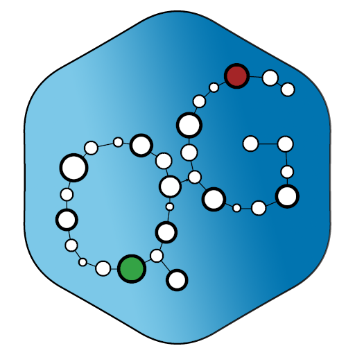

# FastGraph documentation

## Badges

| | |
| --- | --- |
| **Build** |  |
| **Coverage** | Coveralls  SonarQube  | 
| **Quality** |  | 
| **License** | MS-PL |

## Introduction

FastGraph provides generic directed/undirected graph data structures and algorithms.

FastGraph comes with algorithms such as depth first search, breath first search, A* search, shortest path, k-shortest path, maximum flow, minimum spanning tree, etc.

*FastGraph was originally created by Jonathan "Peli" de Halleux in 2003 and named QuickGraph. It was later forked as YC.QuickGraph and QuikGraph.*

**This version** of QuickGraph, renamed **FastGraph**, is a fork of YC.QuickGraph *and* QuikGraph.

The plan is to target cutting-edge .NET 6 and C# 10 features, (initially at the expense of API stability).

You can find library sources on [GitHub](https://github.com/brucificus/FastGraph).

## Targets

- .NET Standard 1.3+
- .NET Core 1.0+
- .NET Framework 3.5+
- Works under [Unity 3D](https://github.com/brucificus/FastGraph/wiki/Unity3D-Integration)

Supports Source Link

## Packages

FastGraph is available on [NuGet](https://www.nuget.org) in several modules.

 [FastGraph](https://www.nuget.org/packages/FastGraph) (Core)

    PM> Install-Package FastGraph

 [FastGraph.Serialization](https://www.nuget.org/packages/FastGraph.Serialization)

    PM> Install-Package FastGraph.Serialization

 [FastGraph.Graphviz](https://www.nuget.org/packages/FastGraph.Graphviz)

    PM> Install-Package FastGraph.Graphviz

 [FastGraph.Data](https://www.nuget.org/packages/FastGraph.Data)

    PM> Install-Package FastGraph.Data

 [FastGraph.MSAGL](https://www.nuget.org/packages/FastGraph.MSAGL)

    PM> Install-Package FastGraph.MSAGL

 [FastGraph.Petri](https://www.nuget.org/packages/FastGraph.Petri)

    PM> Install-Package FastGraph.Petri

